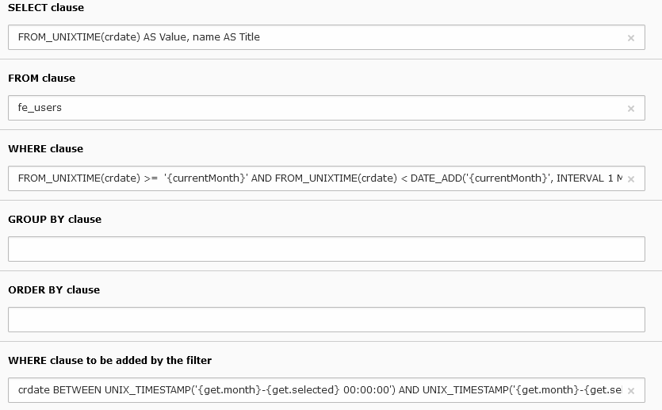

.. include:: ../../Includes.txt

.. _minicalendarFilter:

===================
Minicalendar Filter
===================

The configuration of the query is the same as in the alphabetic filter.
In the following example, the calendar displays the creation of frontend users.
The user name is used as a title attribute for the links.

 
The variable ``{currentMonth}`` is replaced by the current month represented 
in the ``WHERE`` clause. 

.. code::

   FROM_UNIXTIME(crdate) >=  '{currentMonth}' AND FROM_UNIXTIME(crdate) < DATE_ADD('{currentMonth}', INTERVAL 1 MONTH) 
 
The ``WHERE`` clause added by the filter retricts the 
records whose ``crdate`` is within the current day when it is
selected.

.. code::

   crdate BETWEEN UNIX_TIMESTAMP('{get.month}-{get.selected} 00:00:00') AND UNIX_TIMESTAMP('{get.month}-{get.selected} 23:59:59')   