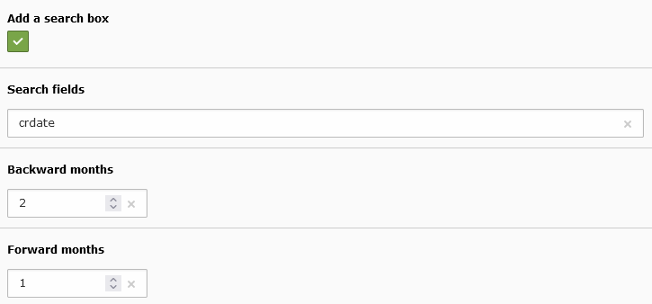

.. include:: ../../Includes.txt

.. _monthsFilter:

=============
Months Filter
=============

The fields for the query part of the months filter are the same as in the alphabetic filter.
In the following example, the query returns the months where frontend users were created. 

.. figure:: ../../Images/MonthsFilterQueryInBackend.png
   :alt: Query for the months filter
  
In the ``WHERE`` clause the variables ``{backwardMonths}`` and ``{forwardMonths}``
are replaced by the configuration values in the flexform.
  
.. code::

   FROM_UNIXTIME(fe_users.crdate) BETWEEN DATE_SUB(DATE_FORMAT(NOW(), '%Y-01-01'), INTERVAL {backwardMonths} MONTH) AND DATE_ADD(DATE_FORMAT(NOW(), '%Y-12-31'), INTERVAL {forwardMonths} MONTH)

The ``WHERE`` clause added by the filter retricts the 
records whose ``crdate`` is within the current month
when it is selected.

.. code::

   crdate BETWEEN UNIX_TIMESTAMP('{get.selected}-01') AND UNIX_TIMESTAMP(DATE_ADD('{get.selected}-01', INTERVAL 1 MONTH) - INTERVAL 1 DAY)

A search box can also be added to the months filter.

