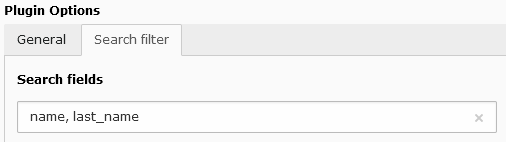

.. include:: ../../Includes.txt

.. _searchFilter:

=============
Search Filter
=============

The search filter is a very simple filter which makes it possible to search
a given input in database fields. The flexform configuration contains 
one field in which the list of comma-separated database fields are input. 

The following example should be used to search in the fields
``name`` and ``last_name``.

.. code::

    name, last_name
