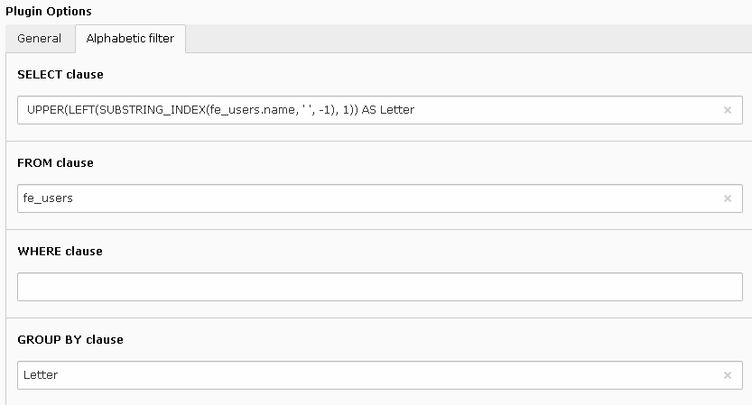
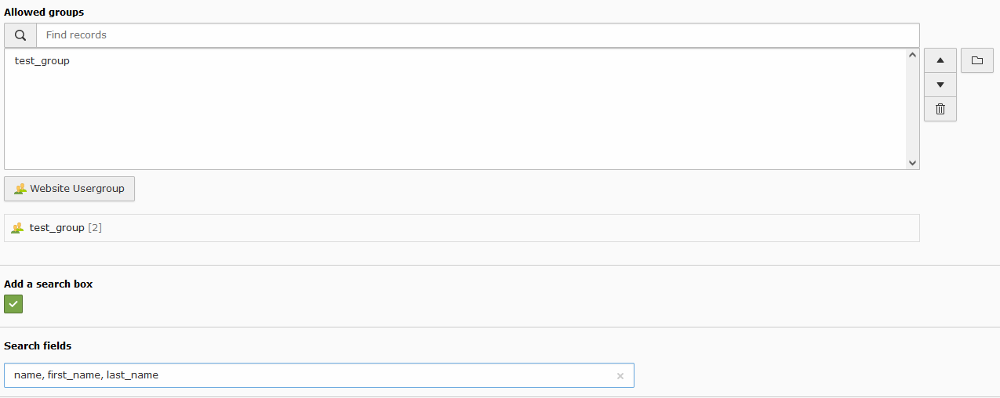

.. include:: ../../Includes.txt

.. _alphabeticFilter:

=================
Alphabetic Filter
=================

The configuration folder for the alphabetic filter contains several fields
to build the query that will be used to generate the list of active letters.
In the following example, the query returns the first letter of the names 
of the frontend users. 

  
.. note::

   Use ``{allowedGroups}`` in the ``WHERE`` clause to add a restriction to 
   the allowed groups.  
  
.. note::

   INNER JOIN part can be added in the FROM field.

The configuration folder contains also a field whose content is the ``WHERE`` 
clause to be added by the filter. In the following example, the filter 
will add a restriction to the selected letter. 
The Fluid variable ``selected`` used in the template must be prepended by ``get``. 

.. figure:: ../../Images/AlphabeticFilterWhereClauseInBackend.png
  :alt: WHERE clause for the alphabetic filter

.. note::

    The ``WHERE`` clause may contain:

    * simple logical expressions like ``deleted`` or ``NOT hidden``.
    * logical expressions on properties like ``property operator operand``, 
      where operator can be =, !=, >, <, >=, <=, LIKE, IN, CONTAINS, or
      ``property BETWEEN operand1 AND operand2``.  
    * operations between logical expressions by using (), NOT, AND, OR.

Finally, the alphabetic filter includes the restriction to frontend 
groups and makes it possible to add a search box.
The search fields must be coma-separated.

